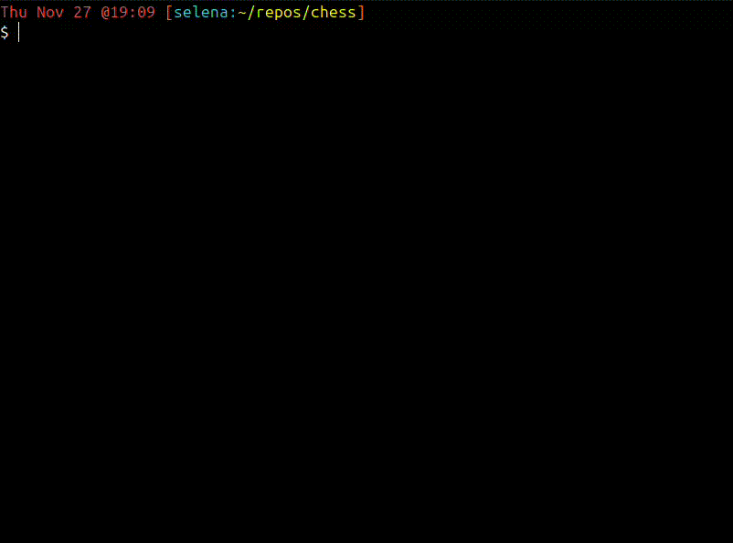

# Game: Chess

Chess is a board game played by two players with sixteen pieces each (one king, one queen, two bishops, two rooks, two knights and eight pawns). One plays with white pieces, and the other plays with black pieces. Both players take turns moving their pieces strategically to capture the opponent's king.

> This project was assigned by [The Odin Project](https://www.theodinproject.com/lessons/ruby-ruby-final-project) curriculum (Ruby Path).

## Demo
 
*Demo game featuring [Scholar's Mate](https://www.chess.com/terms/scholars-mate-chess) checkmating pattern*

## How to play
### Play from the CLI:
#### Prerequisites
- Ruby >= 3.1.2
- Bundler >= 2.3.7

#### Install 
1. [Clone this repository](https://docs.github.com/en/repositories/creating-and-managing-repositories/cloning-a-repository#cloning-a-repository)

*(inside the chess directory)*

2. Run `bundle install`
3. Run `ruby lib/main.rb`

### Play online:
1. Go to [replit](https://replit.com/@ssolunna/chess)
2. Press <kbd>ctrl</kbd><kbd>enter</kbd> or click the play (green) button on the top-left corner

*(Note that, in Replit, some colours may not be properly displayed, but I believe all functionalities are working as intended)*.

## Rules
The game covers pretty much all the rules of a classic game of chess, except for the time clock:
- Default movements of pieces: Pawn, Knight, Rook, Bishop, Queen and King
- Check, mate and stalemate conditions
- Castling move
- Taking en-passant
- Pawn promotion 
- Draw proposal
- Resignation
- Repetition of moves (threefold repetition)
- Fifty-move rule
- Touching pieces

For further information look on the following website: [ChessVariants](https://www.chessvariants.org/d.chess/chess.html)

## Guidelines
- Notation for squares is `[column][row]`, e.g., "e1" for the square on the "e" column/field and "1" row/rank
- You can save the game by typing `save` when prompted to choose a piece. *(Note that if you already saved a game and choose to save another one, the former will be overwritten by the latter)*
- You can resign from playing by typing `resign` when prompted to choose a piece
- If you are not sure what to type, i.e., what pieces are available to move or which moves are legal, press <kbd>enter</kbd> and a range of options will be displayed
- To quickly dismiss the draw proposal prompts, press <kbd>enter</kbd>  

## Acknowledgements
- [Rules and guidance](https://www.chessvariants.org/d.chess/chess.html)
- [Chess pieces ASCII art](https://www.asciiarthub.com/)

## Feedback
If you have any feedback, don't hesitate in letting me know. I'm always open for ways of improvement.
___
Created by [Selena Solunna](http://www.github.com/ssolunna)

___
### Personal notes 
- PERSEVERENCE FOR THE WIN ! 
- Thank God I have finished it.
- In theory, it took me 2 years to complete since my initial commit, with a lot of ups and downs. In practice, it took me about 5 months which felt like 2 years anyway.
- It was truly a joyful challenge, nonetheless. So much learned! Thanks [TOP](https://www.theodinproject.com/).
- Can't believe I got to know about Marshal after grappling with JSON. Anyway, another unintended learning experience.
- Don't even want to touch on Rspec. It was pure pain, but a must-have.
- If you find any bugs or errors... Keep it to yourself. I'm done. /jk
- No, really, I'm kidding. Please let me know. I strive for perfectionism.
